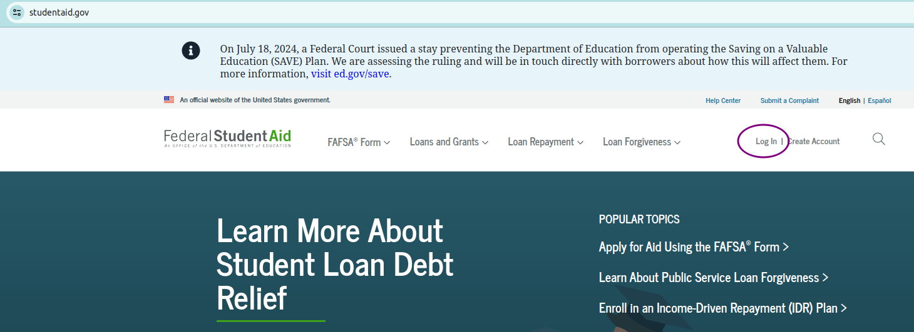
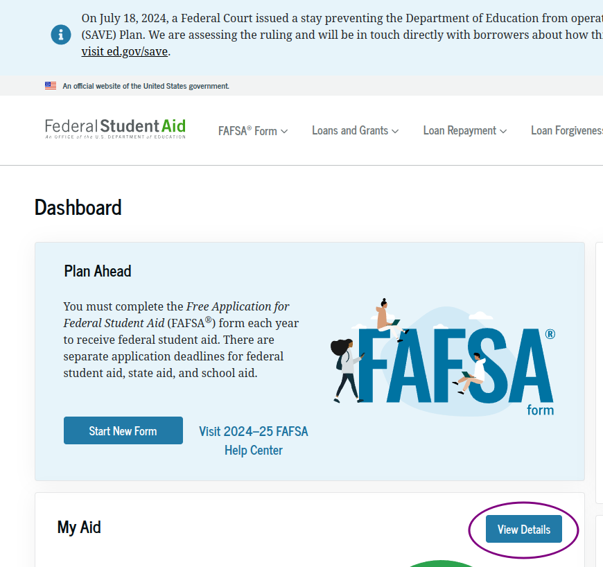
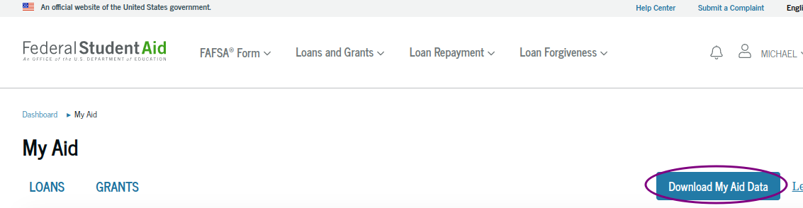
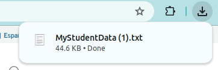
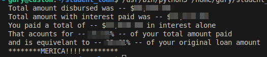

# US_StudentAidLoanSummary
Parser for MyStudentAid.txt File from studentaid.gov

## Why?
Looking through my student loan data it was a pain to try to figure out how much I've actually paid in interest.  
The MyStudentData.txt File does not appear to have a summary and was a bit cryptic to figure out how to read.  
Using a naive approach I put together this parser and tested it on my loan data and it seems to work correctly.  

## Usage:
Log into your account at studentaid.gov

 

Once logged in click on the View Details button

 

Click on Download My Aid Data

 

You should see the file download as "MyStudentData.txt" 
Below example has (1) because I downloaded it twice. 

 

Then just place this file in the same directory as parse_aid.py and run parse_aid.py 
